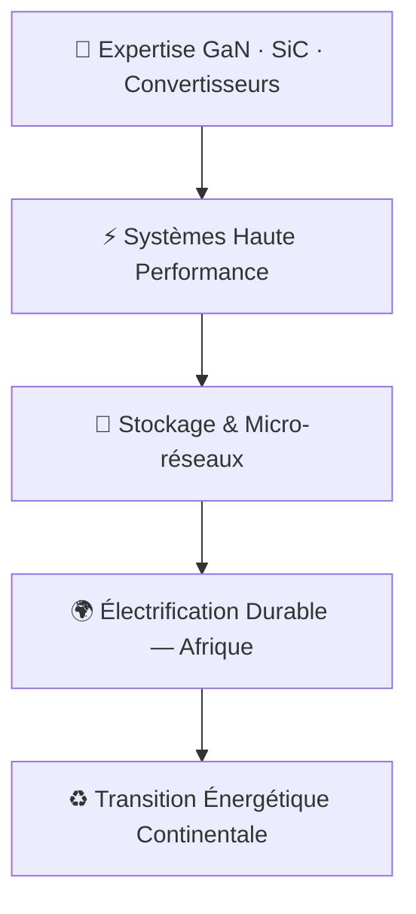

<div align="center">


<br/>

[](https://linkedin.com/in/jauffrey-foukou-gouaka-5b70891b8)
[](mailto:jauffreyfoukou.g@gmail.com)


<br/>

> *« La puissance se contrôle. L'énergie se maîtrise. Le futur se conçoit. »*

</div>

---

## ⚡ À propos

Ingénieur diplômé de l'**ENSEA Cergy** (Spécialité Automatique & Électronique Industrielle — Option Véhicule Électrique), je me spécialise dans la **conception de convertisseurs de puissance** à base de semi-conducteurs grand gap (**GaN, SiC**) et dans les **systèmes embarqués** pour applications énergétiques.

Après deux stages significatifs — l'un chez **Centum T&S (Lyon)** sur un convertisseur DAB 1 kW, l'autre chez **E2C (Brazzaville)** sur la modélisation du réseau électrique national congolais — je cherche à mettre mon expertise au service de la **transition énergétique**, notamment via des systèmes autonomes et des micro-réseaux adaptés aux zones isolées.

```
🎓  Ingénieur ENSEA Cergy, Promo 2025 — AEI / Véhicule Électrique
🏢  Ex-stagiaire : Centum T&S (Lyon) · E2C (Brazzaville) · HUM'ENSEA
🌍  Ambition : Électrification durable à l'échelle continentale africaine
🗣️  Langues : Français (natif) · Anglais (intermédiaire)
```

---

## 🛠️ Stack Technique

### ⚙️ Électronique de Puissance & Hardware

-FF6D00?style=flat-square&logoColor=white)


### 🔬 Simulation & Modélisation


### 🖥️ Systèmes Embarqués & Programmation


### 🌐 Réseaux & Énergie


---

## 💼 Expériences Professionnelles

<table>
<tr>
<td width="50%">

### 🏭 Centum T&S — Lyon
**Stagiaire Ingénieur Power Electronics**
`févr. 2025 → août 2025`

- Étude bibliographique approfondie sur l'architecture **DAB** et ses modes de fonctionnement
- Développement d'une **feuille de calcul paramétrée** pour identifier les points de fonctionnement optimaux et critiques
- Rédaction d'un **plan de mise en service** sécurisé et méthodique
- Simulation de scénarios de test sur **LTspice**

</td>
<td width="50%">

### 🌍 E2C — Brazzaville, Congo
**Stagiaire Assistant Ingénieur Électrotechnique**
`mai 2024 → août 2024`

- **Modélisation complète** du réseau de production et transport électrique de la République du Congo sous ETAP
- Réalisation d'un **écoulement de puissance** pour déterminer les points d'inflexion
- Choix et modélisation d'un **compensateur STATCOM**
- Développement de la **stratégie de commande** sous MATLAB

</td>
</tr>
<tr>
<td colspan="2">

### ☀️ HUM'ENSEA — Cergy & Thioffior
**Responsable Bureau d'Études**
`juin 2023 → juil. 2023`

Bilan énergétique journalier · Cahiers des charges installations solaires · Dimensionnement complet de systèmes photovoltaïques pour établissements scolaires

</td>
</tr>
</table>

---

## 🚀 Projets & Réalisations

### ⚡ Buck Synchrone GaN — 120W @ 500 kHz

> **Convertisseur DC/DC haute fréquence** · Semi-conducteurs grand gap · PCB haute densité

| Paramètre | Valeur |
|---|---|
| Puissance | 120 W |
| Fréquence de découpage | 500 kHz |
| Technologie | CoolGaN Infineon |
| PCB | 4 couches, KiCAD |

- Layout PCB **optimisé pour la réduction des inductances parasites** de boucle de commutation
- Gestion critique du **driver de grille** : temps mort, miller clamp, protection contre le déclenchement parasite (shoot-through)
- Analyse de l'**intégrité du signal** et de la dissipation thermique en régime établi

  

---

### 🔄 Convertisseur Résonant LLC (200W) & PFC Totem-Pole Bridgeless

> **Alimentation AC/DC haute efficacité** · Commutation douce · Absorption sinusoïdale

**LLC Résonant — 200W**
- Modélisation théorique complète du **tank résonant** (Lr, Cr, Lm)
- Analyse du plan de phase pour garantir le **ZVS** (Zero Voltage Switching) sur toute la plage de charge
- Dimensionnement du transformateur et étude de la régulation par modulation de fréquence

**PFC Totem-Pole Bridgeless**
- Étude de la topologie pour **absorption sinusoïdale** du courant réseau
- Analyse du **THD** (Taux de Distorsion Harmonique) et du facteur de puissance
- Comparaison des performances avec les topologies classiques (boost PFC)

  

---

### 🔁 Dual Active Bridge (DAB) — 1 kW · *Centum T&S, Lyon*

> **Convertisseur DC/DC bidirectionnel isolé** · Application stockage d'énergie · Mise en production

| Paramètre | Valeur |
|---|---|
| Puissance | 1 kW |
| Architecture | DAB — isolation galvanique |
| Modes étudiés | triangle, trapèze |
| Outils | LTspice + banc expérimental |

- Développement d'une **feuille de calcul paramétrée** pour l'identification des points de fonctionnement optimaux et critiques
- **Modélisation complète des pertes** : conduction, commutation
- Simulations des scénarios de test sous **LTspice** + essais expérimentaux de rendement et de thermique
- Rédaction d'un **plan de mise en service** sécurisé et méthodique pour déploiement industriel

 

---

### 🌍 Réseau Électrique National du Congo — STATCOM · *E2C, Brazzaville*

> **Modélisation réseau HTA/HTB** · Compensation dynamique · Infrastructure nationale

- **Modélisation complète** du réseau de production et de transport électrique de la République du Congo sous **ETAP**
- Réalisation d'un **écoulement de flux de puissance** pour identifier les points d'inflexion critiques du réseau
- Choix, dimensionnement et modélisation d'un **compensateur STATCOM** (shunt dynamique)
- Développement de la **stratégie de commande** du STATCOM sous MATLAB/Simulink

  

---

### 🔋 Convertisseur DC-DC pour Pack Batterie & Véhicule Électrique

> **Énergie embarquée** · Gestion bidirectionnelle · Commande temps réel

- Dimensionnement d'un **convertisseur DC-DC bidirectionnel** dédié à un pack de batterie
- **Commande de convertisseur de puissance** pour véhicule électrique (MLI, régulation courant/tension)
- Modélisation d'un **convertisseur AC-DC à absorption sinusoïdale** (correction du facteur de puissance)

  

---

## 📊 Compétences — Vue d'ensemble

```
Électronique de Puissance (GaN/SiC)    ███████████████████░  95%
Simulation (LTspice / MATLAB / PSIM)   ██████████████████░░  90%
Conception PCB (Altium / KiCad)        █████████████████░░░  85%
Réseaux Électriques (ETAP / STATCOM)   ████████████████░░░░  80%
Systèmes Embarqués (STM32 / C/C++)     ███████████████░░░░░  75%
Commande Machines Électriques          ██████████████░░░░░░  70%
```

---

## 🎯 Vision



L'**électronique de puissance** est le levier technologique de la transition énergétique. Mon objectif : concevoir des systèmes robustes, efficaces et adaptés aux réalités des réseaux isolés — pour que chaque communauté puisse accéder à une énergie propre et fiable.

---

## 📈 GitHub Stats

<div align="center">


</div>

---

## 🎓 Formation

| Diplôme | Établissement | Période |
|---|---|---|
| 🎓 **Ingénieur AEI** — Option Véhicule Électrique | ENSEA, Cergy | 2022 – 2025 |
| 📐 **DUT GEII** | IUT de Troyes | 2019 – 2022 |
| 🏫 **Baccalauréat Scientifique** | Les Minimes, Brazzaville | 2017 – 2018 |

---

## 🌱 Au-delà de l'ingénierie

| Domaine | Détail |
|---|---|
| 📖 Philosophie | Rationalisme — Leibniz, Spinoza, Kant |
| 🏋️ Sport | Entraînements de force & force athlétique |
| 📚 Lecture | Science-fiction, Romans, Mangas complexes |
| 🍳 Cuisine | Créativité et précision — comme en ingénierie |

---

<div align="center">


**`Concevoir · Simuler · Réaliser · Électrifier`**

*Ouvert aux opportunités en électronique de puissance, énergie embarquée et transition énergétique.*

[](https://linkedin.com/in/jauffrey-foukou-gouaka-5b70891b8)

</div>
